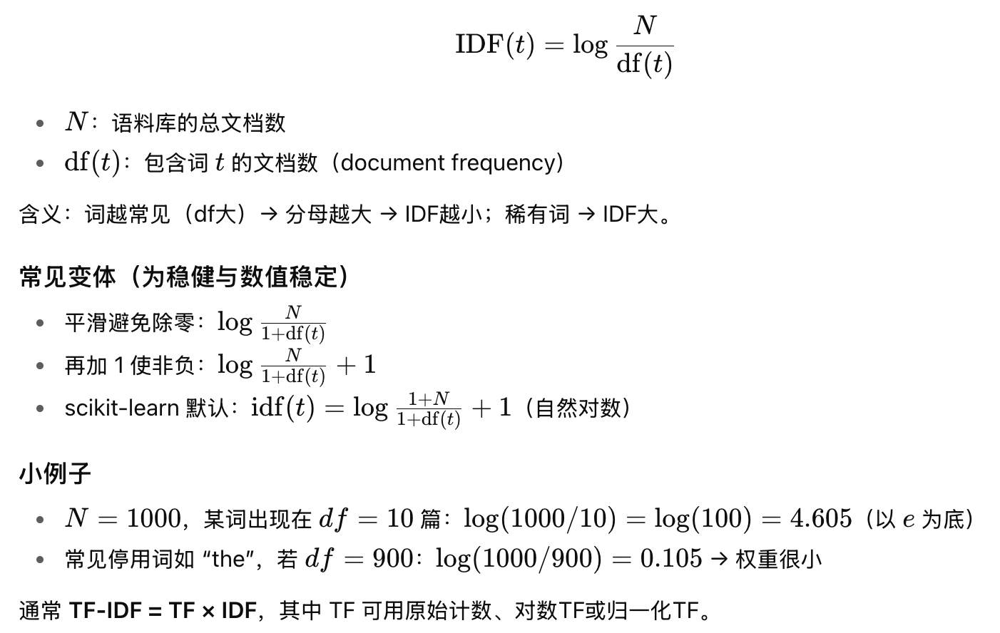

## 我们来详细介绍一下自然语言处理和信息检索领域的一个基础且重要的算法——TF-IDF。##

### 一、 TF-IDF 是什么？###
TF-IDF 的全称是 Term Frequency-Inverse Document Frequency，即词频-逆文档频率。

它是一种用于信息检索与文本挖掘的统计方法，用以评估一个词语对于一个文件集或一个语料库中的其中一份文件的重要程度。

核心思想：一个词语在一篇文章中出现的次数（TF）越多，同时在所有文档中出现的次数（DF）越少，越能代表该文章。这意味着，TF-IDF倾向于过滤掉常见的词语，保留重要的、有区分度的词语。


###  二、 为什么需要 TF-IDF？### 
实际例子
假设我们有以下酒店描述：

```Text
酒店A：豪华海景房，免费WiFi，靠近海滩
酒店B：经济型房间，基础设施，市中心位置  
酒店C：高端海景房，免费WiFi，私人阳台
```

TF-IDF会这样处理：

```text
"豪华"、"经济型" → IDF低（常见词，不重要）
"海景房"、"私人阳台" → IDF高（稀有词，重要）
"免费WiFi" → IDF中等（常见但有用）
```

#### 三、 为什么稀有词更重要？
- 区分性强：能帮助识别特定特征
- 描述性好：很少出现的词往往代表独特属性
- 信息量大：稀有词汇承载更多信息

词频高 = 重要性低

大家都有的特性（如"空调"、"热水"）
缺乏区分度，不能帮助识别独特特征
因此权重较低
词频低 = 重要性高

独特的特色属性（如"海景房"、"私人阳台"）
具有区分度，能帮助识别特定酒店
因此权重较高
在酒店推荐中的应用

```text
酒店A：经济型，基础设施，市中心
酒店B：豪华海景房，免费WiFi，私人阳台
酒店C：商务型，会议设施，机场附近
```

通过TF-IDF向量化后：
```text
低权重词：空调、热水（常见，不重要）
高权重词：海景房、私人阳台（独特，重要）
```

这样系统就能：

1. 识别出酒店的独特卖点
2. 根据用户偏好匹配相似特征的酒店
3. 提供更精准的个性化推荐

因此，TF-IDF将两者结合，完美地解决了这个问题：

TF 部分负责找出当前文档的关键词（在当前文档中出现频繁）。

IDF 部分负责降低常见词的权重，提升特征词的权重。

###  三、 TF-IDF 的组成部分 ### 
TF-IDF由两个部分相乘构成：

TF-IDF = TF × IDF

让我们来拆解它们：

1. 词频 - TF
定义：表示一个给定的词语在一篇文档中出现的频率。

计算方法：有多种方式，最常见的是：

原始计数： TF(t, d) = (词语t在文档d中出现的次数)

标准化频率（更常用）：为了防止偏向长文档（长文档的词频天然更高），通常会对词频进行标准化。
TF(t, d) = (词语t在文档d中出现的次数) / (文档d中所有词语的总数)

例如：一篇文档有100个词，其中“苹果”出现了5次，那么 TF(苹果, d) = 5 / 100 = 0.05。

2. 逆文档频率 - IDF
定义：衡量一个词语的普遍重要性。如果一个词语在所有文档中都很常见（如“的”），那么它的IDF值会很低；反之，如果一个词语很罕见，它的IDF值就很高。

计算方法：



说明：

N：语料库中文档的总数。在本例是152个酒店的desc

t: 包含词语t的文档数：也叫文档频率。如果一个词在越多的文档中出现，这个分母就越大，IDF值就越小。在本例是152个酒店当中带有词语他的数量。

log：对数函数（通常使用自然对数或以10为底的对数），用于压缩尺度，使IDF值不会过大。

+1：拉普拉斯平滑项。防止分母为0（即当某个词不在任何文档中出现时）。

例如：假设语料库有1000篇文档（N=1000）。

“的”这个词在990篇文档中都出现了，那么 IDF(的) = log(1000 / (990 + 1)) ≈ log(1.009) ≈ 0。

“神经网络”这个词只在10篇文档中出现，那么 IDF(神经网络) = log(1000 / (10 + 1)) ≈ log(90.9) ≈ 4.5。

可以看到，“神经网络”的IDF值远高于“的”，说明它是一个更有区分度的词。

###  四、 计算示例 ### 
假设我们有一个包含3篇文档的小型语料库：

文档1：“这是 一个 苹果”

文档2：“那个 苹果 是 我的”

文档3：“这是 他的 苹果 和 他的 香蕉”

现在，我们计算词语“苹果”在文档1中的TF-IDF值。

计算 TF(苹果, 文档1)：

文档1总词数：4

“苹果”出现次数：1

TF(苹果, 文档1) = 1 / 4 = 0.25

计算 IDF(苹果, 语料库)：

语料库中文档总数 N = 3

包含“苹果”的文档数：3（文档1、2、3都包含）

IDF(苹果) = log(3 / (3 + 1)) = log(3/4) ≈ log(0.75) ≈ -0.1249 (这里使用自然对数)

注意：在这个小例子中，因为“苹果”出现在所有文档中，所以它的IDF是负值，这在实际应用中很常见，并且不影响它在同一语料库内的相对重要性比较。

计算 TF-IDF(苹果, 文档1)：

TF-IDF(苹果, 文档1) = 0.25 * (-0.1249) ≈ -0.031

我们再计算一个更有区分度的词“香蕉”在文档3中的TF-IDF值。

TF(香蕉, 文档3)：

文档3总词数：6

“香蕉”出现次数：1

TF = 1 / 6 ≈ 0.167

IDF(香蕉)：

包含“香蕉”的文档数：1（只有文档3）

IDF = log(3 / (1 + 1)) = log(3/2) = log(1.5) ≈ 0.405

TF-IDF(香蕉, 文档3)：

TF-IDF = 0.167 * 0.405 ≈ 0.068

结论：虽然“香蕉”在文档3中的TF值比“苹果”在文档1中的低，但由于它的IDF值很高（因为它很独特），最终其TF-IDF值反而更高，更能代表文档3。

###  五、 TF-IDF 的应用 ### 
搜索引擎：用于计算查询词与文档的相关性得分。用户输入的查询词会被视为一个微型文档，计算其中每个词的TF-IDF，并与库中所有文档的TF-IDF向量进行相似度比较（如余弦相似度）。

文本相似度计算：将两篇文章分别用TF-IDF向量表示，然后计算它们之间的余弦相似度，值越接近1，说明文章越相似。

文档关键词自动提取：对一篇文档中的所有词语计算TF-IDF值，然后排序，取Top-N个词作为文档的关键词。

文本分类/聚类：作为机器学习模型的输入特征。每篇文档都可以表示为一个高维向量，向量的每一维对应一个词的TF-IDF值。

###  六、 TF-IDF 的优缺点 ### 
优点：
简单有效：原理简单，计算相对容易，效果在多数情况下不错。

理论基础清晰：有明确的数学和统计学意义。

无监督：不需要额外的标注数据。

缺点：
无法捕捉语义信息：它纯粹基于词袋模型，无法理解词语的语义。“汽车”和“车辆”会被视为完全不同的词。

无法捕捉词序信息：像“猫追老鼠”和“老鼠追猫”的TF-IDF向量是完全一样的。

对低频词不友好：如果某个重要词只在极少数文档中出现，IDF会给它极高的权重，但这可能是噪声。

假设词之间相互独立：这与语言事实不符。

### 七、 与现代方法（如Word2Vec, BERT）的对比 ### 
- TF-IDF：是一种基于频率统计的浅层文本表示方法。
- Word2Vec, GloVe：是基于预测或共现矩阵的词嵌入方法，能将单词映射到稠密向量空间中，语义相似的词在空间中的位置也接近。
- BERT：是基于Transformer的深度预训练模型，能生成上下文相关的词向量。同一个词在不同的句子中会有不同的向量表示。

总结：TF-IDF在今天依然被广泛使用，尤其是在计算资源有限、需要快速实现、或者作为基线模型的场景。对于更复杂的语义理解任务，深度学习方法（如BERT）通常表现更好，但它们也更为复杂和耗时。很多时候，将TF-IDF与词嵌入等现代技术结合使用也能取得很好的效果。