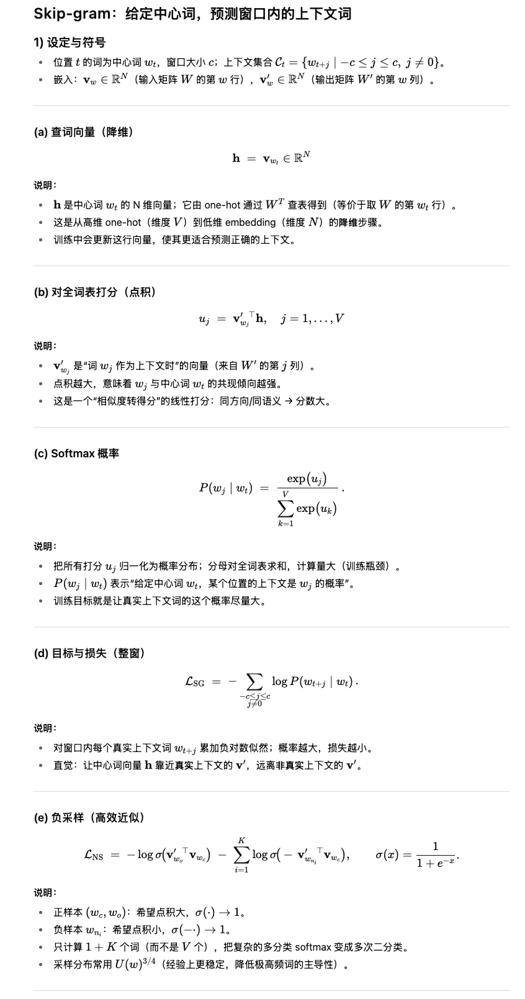

## 一、核心思想：颠覆传统的“意义”表示
在 Word2Vec 之前，表示单词的主要方法是 one-hot 编码：
假设词汇表有 10,000 个词，"国王" 可能是 [1, 0, 0, ..., 0]，"皇后" 可能是 [0, 1, 0, ..., 0]。
问题：这种表示法无法体现任何词与词之间的关系（如语义、语法）。所有向量都是正交的，点积为零。计算机无法从编码中得知“国王”和“皇后”都是君主。

`Word2Vec` 的革命性思想：**一个词的意义，是由它上下文中出现的词来定义的**。

“You shall know a word by the company it keeps.” (J. R. Firth)
你可以通过一个词的“伙伴”来了解它。

这个思想引出了 Word2Vec 的分布假说：在相似上下文中出现的单词，其语义也相似。

Word2Vec 的目标：将每个单词映射到一个稠密向量（例如 300 维），使得在原始文本中语义或语法上相似的单词，在向量空间中的位置也彼此接近。

## 二、两种模型架构
Word2Vec 提供了两种主要模型来实现上述思想：

### Continuous Bag-of-Words (CBOW)：通过上下文预测中心词。

输入：周围窗口内的所有上下文词。
输出：预测中心词（Target Word）是什么。

类比：完形填空。给定“今天 __ 天气真好”，预测空白处的词是“的”。

### Skip-gram：通过中心词预测上下文。

输入：中间的一个中心词（Target Word）。
输出：预测它周围可能出现的邻词(上下文词)。

类比：给出一个词，让你列出它常见的搭配。给出“学习”，你可能会列出“知识”、“课程”、“努力”等。

| 模型            | 输入                 | 输出                 | 说明         |
| ------------- | ------------------ | ------------------ | ---------- |
| **CBOW**      | 上下文（Context Words） | 中心词（Target Word）   | 根据上下文预测中心词 |
| **Skip-gram** | 中心词（Target Word）   | 上下文（Context Words） | 根据中心词预测上下文 |


一个重要的事实：在大多数情况下，尤其是在训练数据量充足时，Skip-gram 模型在生僻词表征和语义任务上的表现通常优于 CBOW，但训练速度更慢。CBOW 训练更快，对高频词的表征更好。
| 模型            | 训练速度 | 稀有词表现 | 高频词表现 | 特点               |
| ------------- | ---- | ----- | ----- | ---------------- |
| **CBOW**      | 快    | 稍弱    | 较好    | 平均化上下文信息，噪声小     |
| **Skip-gram** | 慢    | 更好    | 稍弱    | 对低频词更敏感，捕捉稀有语义更强 |


### 三、Skip-gram 模型详解
1. 模型结构
`Skip-gram` 的结构其实是一个简单的**单隐藏层神经网络**。

组成部分：
- 输入层 (Input Layer)：一个 one-hot 编码向量，维度为 V（词汇表大小）。例如，词汇表有 10,000 个词，输入词是第 35 个词，那么输入向量就是 [0, 0, ..., 1, ..., 0]，只有第 35 位是 1。
- 隐藏层 (Hidden Layer)：维度为 N（嵌入维度，如 300）。没有激活函数（或者说用的是线性激活函数）。
- 输出层 (Output Layer)：维度为 V（词汇表大小）。使用 Softmax 函数来输出概率分布，表示每个词作为上下文词出现的概率。

2. 关键：两个权重矩阵
这是理解 Word2Vec 的最核心部分。模型学习两个权重矩阵：

# 🧩 输入权重矩阵 W（Input / Embedding Matrix）

---

## 1️⃣ 定义与形状

**矩阵名称：** 输入权重矩阵 \( W \)  
**又称：** 输入嵌入矩阵 (Input / Embedding Matrix)  
**形状：** \( V \times N \)

| 符号 | 含义 |
|------|------|
| \( V \) | 词汇表大小（Vocabulary size） |
| \( N \) | 词向量维度（Embedding dimension） |

---

## 2️⃣ 作用

当一个词 \( w_i \) 作为 **中心词（center word / target word）** 时，  
我们使用矩阵 **W** 来获取它的词向量。

> ✅ **关键点：**  
> W 的第 *i* 行就是词汇表中第 *i* 个单词作为中心词时的向量表示。

---

## 3️⃣ 输入矩阵的“降维”作用

在 Word2Vec 中，每个词最初是一个 **One-Hot 向量**：

- 长度等于词汇表大小 \(V\)
- 只有一个位置是 1，其他都是 0  
- 高维、稀疏（sparse）且不含语义信息  

例如：
```
"北京" → [0, 0, 1, 0, 0, 0, ..., 0] # 长度 10,000
```

但是神经网络无法直接从这样的表示中学习语义。  
于是我们用输入矩阵 \(W\) 做一个 **线性变换（降维）**：


```text
W^T (3×5)       x (5×1)           =   h (3×1)
[0.1, 0.4, 0.7, 1.0, 1.3]   [0]       [0.7]
[0.2, 0.5, 0.8, 1.1, 1.4] · [0]   =   [0.8]
[0.3, 0.6, 0.9, 1.2, 1.5]   [1]       [0.9]
                             [0]
                             [0]
```

这样，模型就把一个 **高维离散表示（10,000 维）**  
映射成一个 **低维连续表示（比如 300 维）**。

| 对比 | One-Hot | Embedding |
|------|----------|-----------|
| 维度 | 高（词汇表大小 V） | 低（向量维度 N） |
| 特征 | 稀疏（几乎全 0） | 稠密（每个值有意义） |
| 是否含语义 | ❌ 否 | ✅ 是 |

> 🧠 **理解：**
> 输入矩阵 \( W \) 就是一个“降维映射表”，  
> 它把每个词从符号空间压缩到语义空间，  
> 并让语义相似的词在这个空间里靠得更近。

---

## 4️⃣ 实例演示：W 如何从 One-hot 提取词向量

### 场景设定
词汇表：`['我', '爱', '北京', '天安门', '的']`  
词汇表大小：`V = 5`  
词向量维度：`N = 3`

---

### 第一步：创建输入矩阵 W

W 的形状是 `5 × 3`，即：
> 5 行（每个词一个向量） × 3 列（每个向量 3 维）

初始随机值如下：

| 索引 | 单词 | W 中的向量（中心词向量） |
|------|------|----------------------------|
| 0 | 我 | [0.1, 0.2, 0.3] |
| 1 | 爱 | [0.4, 0.5, 0.6] |
| 2 | 北京 | [0.7, 0.8, 0.9] |
| 3 | 天安门 | [1.0, 1.1, 1.2] |
| 4 | 的 | [1.3, 1.4, 1.5] |

---

### 第二步：构造 One-hot 向量

| 单词 | One-hot 向量 |
|------|---------------|
| 我 | [1, 0, 0, 0, 0] |
| 爱 | [0, 1, 0, 0, 0] |
| 北京 | [0, 0, 1, 0, 0] |
| 天安门 | [0, 0, 0, 1, 0] |
| 的 | [0, 0, 0, 0, 1] |

---

### 第三步：执行查找操作（矩阵乘法）

我们要获取 “北京” 的中心词向量。


矩阵形状：
```
W^T: 3×5
x:   5×1
→ h: 3×1

```

手动计算：
```
W^T (3×5)        x (5×1)          =   h (3×1)
[0.1, 0.4, 0.7, 1.0, 1.3]   [0]       [0.7]
[0.2, 0.5, 0.8, 1.1, 1.4] · [0]   =   [0.8]
[0.3, 0.6, 0.9, 1.2, 1.5]   [1]       [0.9]
                              [0]
                              [0]
```

👉 结果：

`h = [07, 0.8, 0.9]`

也就是矩阵 W 的第 2 行（索引从 0 开始）。

## 5️⃣ 查找的本质（Lookup Operation）

这个乘法过程：

本质上是一个查找（lookup）操作：

> Key（键）＝ one-hot 向量中 1 的位置  
> Value（值）＝ 矩阵 W 中对应行的向量  

在代码实现中，我们不会真的做矩阵乘法（那样太浪费计算），  
而是直接按索引取行：

```python
word_to_index = {'我': 0, '爱': 1, '北京': 2, '天安门': 3, '的': 4}
W = [
    [0.1, 0.2, 0.3],
    [0.4, 0.5, 0.6],
    [0.7, 0.8, 0.9],
    [1.0, 1.1, 1.2],
    [1.3, 1.4, 1.5]
]

center_word = '北京'
center_index = word_to_index[center_word]
center_vector = W[center_index]

print(center_vector)  # [0.7, 0.8, 0.9]
```

6️⃣ 总结

1. 输入矩阵 𝑊是一个 V×N 的参数表，每一行是一个词的向量。
2. 矩阵乘法实际上是一个“按索引取行”的查找操作。
3. 它完成了从 高维稀疏（One-hot） 到 低维稠密（Embedding） 的降维变换。
4. 通过训练，W 会逐渐学出语义信息，使得相似词的向量在空间中更接近。

---

## 输出权重矩阵 W′（Output / Context Matrix）

---
1️⃣ 定义与形状

矩阵名称： 输出权重矩阵 W′

形状： 𝑁 × 𝑉

𝑁：词向量维度（与输入矩阵的列数相同）
𝑉：词汇表大小

每一列代表一个词在“作为上下文词（context word）”时的向量。与输入矩阵 W 相比，W′ 是“从隐藏层向输出层”的映射矩阵。

2️⃣ 计算过程示例

假设输入矩阵 W 给出了“北京”的中心词向量：
```
h = [0.7, 0.8, 0.9]   # 维度 1×3
```

输出矩阵 W′（3×5）如下：

| 词索引 | 上下文词 | W′ 的列向量            |
| --- | ---- | ------------------ |
| 0   | 我    | [0.15, 0.16, 0.17] |
| 1   | 爱    | [0.25, 0.26, 0.27] |
| 2   | 北京   | [0.35, 0.36, 0.37] |
| 3   | 天安门  | [0.45, 0.46, 0.47] |
| 4   | 的    | [0.55, 0.56, 0.57] |

---
3️⃣ 步骤一：计算每个词的得分（点积）

模型要预测哪些词可能出现在“北京”的上下文中。
因此计算中心词向量 h 与 W′ 中每一列的点积：


计算结果（部分展示）：
| 上下文词 | 计算                             | 得分 (u_j) |
| ---- | ------------------------------ | -------- |
| 我    | 0.7×0.15 + 0.8×0.16 + 0.9×0.17 | 0.386    |
| 爱    | 0.7×0.25 + 0.8×0.26 + 0.9×0.27 | 0.626    |
| 北京   | 0.7×0.35 + 0.8×0.36 + 0.9×0.37 | 0.866    |
| 天安门  | 0.7×0.45 + 0.8×0.46 + 0.9×0.47 | 1.106    |
| 的    | 0.7×0.55 + 0.8×0.56 + 0.9×0.57 | 1.346    |

得到原始分数向量：

`u=[0.386,0.626,0.866,1.106,1.346]`

---


---
6️⃣ W′ 的角色与地位
| 阶段       | 角色    | 描述                                                |
| -------- | ----- | ------------------------------------------------- |
| **训练阶段** | 协同学习者 | 与 W 一起学习语义关系。每一列（词）作为“上下文”提供比较基准，用来衡量中心词与上下文的相似度。 |
| **反向传播** | 信号传递者 | 接收 softmax 误差信号，指导中心词向量（W）朝正确方向移动。                |
| **推理阶段** | 可选保留  | 通常我们只保留 W 作为最终词向量，也可将 W 和 W′ 平均或拼接使用。             |

---
7️⃣ 一词两向量的意义

训练结束后，每个词都有两种语义角色：
| 向量来源      | 语义身份       | 矩阵   | 说明                                   |
| --------- | ---------- | ---- | ------------------------------------ |
| 来自 **W**  | **中心词向量**  | 输入矩阵 | 当词作为中心词（target）时，从 one-hot 经 W 映射获得其低维表示（降维）。该向量用于预测上下文词。         |
| 来自 **W′** | **上下文词向量** | 输出矩阵 | 当词出现在别人上下文中时的表示，用来计算与中心词的相似度并指导训练更新。 |


✅ W′ 的作用：它不仅表示“词在别人语境中出现的样子”，还承担着训练中“计算相似度、传递误差、更新语义关系”的功能。

---
8️⃣ 总结

1. 输出矩阵 W′ 的形状为 N×V，每一列对应一个上下文词的向量。
2. 模型通过计算中心词向量与这些列向量的 点积 来预测上下文概率。
3. 训练时，W 与 W′ 协同更新，W′ 充当“比较参照”的角色。
4. 推理时，一般只保留输入矩阵 W，也可结合两者获取更丰富的词表示。

🎯 一句话总结：
输出矩阵 W′ 是 Skip-gram 模型的“预测层”，它把隐藏层向量（中心词）映射回词汇表空间，通过与所有上下文词的相似度计算，指导模型学习语义关系。
---


CBOW vs Skip-gram 对比总结。
我分成四个部分来讲：原理、输入输出、优缺点、以及适用场景。

🧩 一、基本概念
| 模型            | 全称                      | 核心思想                |
| ------------- | ----------------------- | ------------------- |
| **CBOW**      | Continuous Bag of Words | 通过**上下文词**预测**中心词** |
| **Skip-gram** | Skip-gram Model         | 通过**中心词**预测**上下文词** |


💡 两者的方向相反：

CBOW：Context → Target
Skip-gram：Target → Context

⚙️ 二、输入输出结构
| 模型            | 输入         | 输出         | 示例说明                                             |
| ------------- | ---------- | ---------- | ------------------------------------------------ |
| **CBOW**      | 上下文窗口内的多个词 | 中心词        | 输入：["the", "brown", "fox", "jumps"] → 输出："quick" |
| **Skip-gram** | 中心词        | 上下文窗口内的多个词 | 输入："quick" → 输出：["the", "brown", "fox", "jumps"] |


🧠 三、模型内部机制


⚖️ 四、性能与适用场景对比
| 特性          | **CBOW**    | **Skip-gram** |
| ----------- | ----------- | ------------- |
| **训练速度**    | 较快（一次预测一个词） | 较慢（一次预测多个词）   |
| **对高频词**    | 表征更好        | 表征一般          |
| **对低频词**    | 效果较差        | 更擅长学习稀有词语义    |
| **内存占用**    | 较小          | 稍大（更多训练样本）    |
| **语义捕捉能力**  | 偏向全局        | 偏向局部、细粒度关系    |
| **上下文窗口使用** | 汇聚上下文信息平均化  | 保留各个上下文词独立信息  |
| **典型用途**    | 快速训练、通用语义表示 | 精准语义建模、细节任务   |


📘 五、直观理解（类比）
| 比喻 | CBOW                               | Skip-gram                                       |
| -- | ---------------------------------- | ----------------------------------------------- |
| 类比 | **完形填空题**：给出周围词，猜中间缺的词             | **联想词游戏**：给定一个词，列出它常见搭配                         |
| 例子 | “I ___ playing football” → 预测 “am” | “football” → 预测 “play”, “team”, “goal”, “match” |

✅ 六、总结一句话

- CBOW： 从上下文推测词义，训练快、适合大规模数据。
- Skip-gram： 从词义推测上下文，训练慢、但对稀有词效果更好。

📌 实际使用中：

若语料大、对速度敏感 → 用 CBOW；
若希望捕捉更精细的语义关系 → 用 Skip-gram。

---



---


---


🧠 四、直觉理解：Softmax vs 负采样
| 对比点  | Softmax            | 负采样             |
| ---- | ------------------ | --------------- |
| 优化目标 | 拟合整个概率分布           | 拟合“是否共现”的局部真相   |
| 计算对象 | 所有词                | 正样本 + 几个负样本     |
| 性质   | 多分类（one-of-V）      | 多次二分类           |
| 训练速度 | 慢                  | 极快              |
| 含义   | “在所有词中，哪个是正确的上下文？” | “这些词中，谁真的与我搭配？” |
| 实际表现 | 理论最优               | 实践最有效           |

🔍 五、总结一句话

负采样不是为了改变概率定义，而是为了让训练更高效。
Softmax 定义了正确的概率目标，但太贵；
负采样用局部二分类的方式近似了这个目标；
它保留了“让正确的词靠近，错误的词远离”的学习信号；
同时把计算复杂度从 O(V) 降到了O(K)。

✅ 核心直觉图示：

```
Center word:  "brown"
True context: "fox"
Neg samples : "apple", "car", "piano", "flight", "teacher"

→ Learn:
σ(v'_fox · v_brown) → 1
σ(v'_apple · v_brown) → 0
σ(v'_car   · v_brown) → 0
...
```


只更新这 6 个词的向量，而不是 100,000 个。
